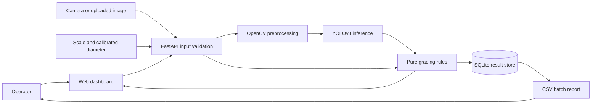
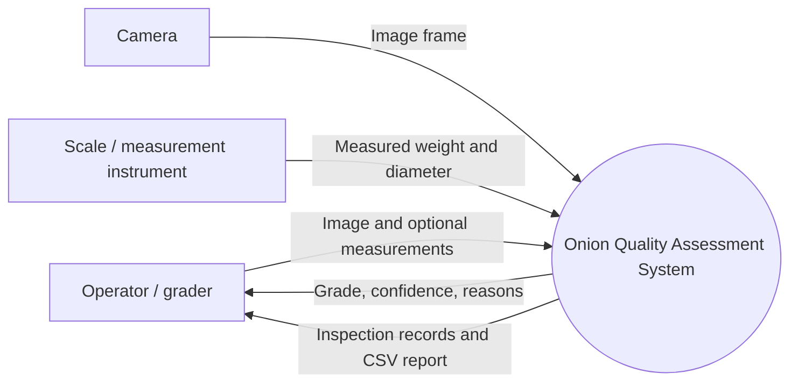
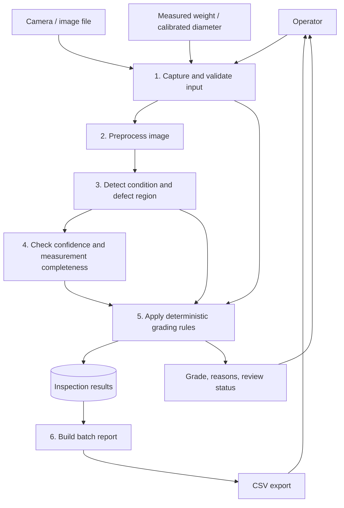
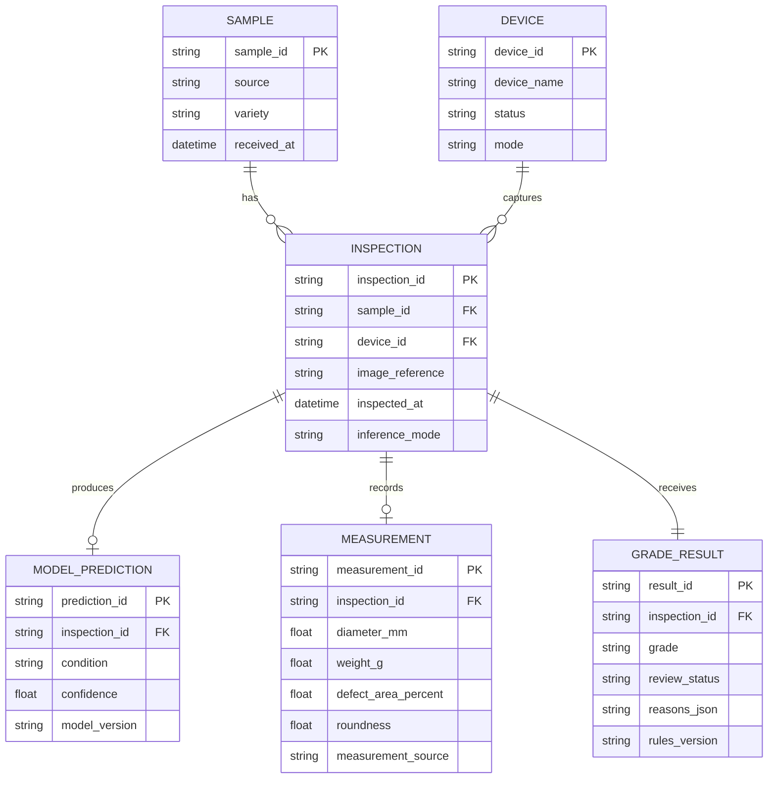
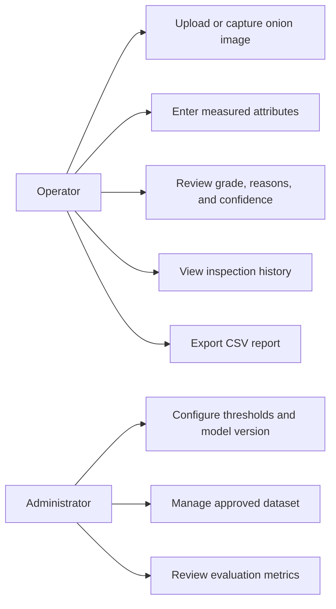

# Onion Quality Assessment and Grading System

**College Project Documentation**  
**Project code:** SIH26031  
**Team:** INNOVEXA  
**Project type:** Computer-vision-assisted onion assessment and grading prototype

> **Implementation status:** The dashboard captures real onion images through browser camera access and applies the prototype rules to operator-entered measurements and visual estimates. Captured-image records exist only in browser memory for the current session. It does not perform image inference, use physical sensors, or infer real-world size/weight from an image. The AI, API, and database sections describe the proposed system, not completed functionality.

## Abstract

Onion grading is commonly performed by visual inspection, which can be slow and inconsistent when many bulbs must be sorted. This project proposes a system that combines image processing, visible-defect assessment, optional measured attributes, and deterministic grading rules to support onion inspection. The planned workflow captures an onion image, preprocesses it, detects visible conditions, combines image findings with supplied measurements such as diameter and weight, assigns a grade, and presents an explainable result in a dashboard. The prototype grade rules reject bulbs with detected rot/fungus or defect area above 25%, then check Grade A and Grade B thresholds, assigning Grade C otherwise. A low-confidence or insufficiently measured result should be flagged for review. The current public application demonstrates the dashboard and grading rules through simulation only; model accuracy, sensor performance, and operational suitability remain unverified until supported by a labeled dataset and physical trials.

**Keywords:** onion grading, computer vision, defect detection, image processing, quality assessment, explainable grading

## 1. Introduction

Onion quality assessment can consider size, shape, color, skin condition, and visible defects. Manual grading is labor-intensive and individual judgments may differ. A computer-vision system can help standardize visible-condition inspection, while calibrated measurements and scales provide real-world diameter and weight.

An ordinary RGB image does not establish weight or physical diameter in millimetres. Diameter-from-image requires a reference object and controlled camera geometry or another calibration method; weight requires a scale or user-supplied measurement. The system must preserve these distinctions and report unavailable measurements as unknown.

## 2. Problem Statement

Manual onion grading may require substantial time and labor, and repeated handling can damage bulbs. An automated assessment workflow could make initial inspection more consistent, but its output is only trustworthy when image capture, labels, model performance, measurement calibration, and grading criteria are validated. The project therefore focuses on a transparent prototype and a testable system design rather than claiming commercial-grade accuracy.

## 3. Aim and Objectives

### Aim

To design and evaluate a prototype system for image-assisted onion quality assessment and explainable grade assignment.

### Objectives

1. Define an explicit class and measurement contract for onion inspection.
2. Prepare a labeled image dataset for visible-condition analysis.
3. Develop repeatable image preprocessing and model evaluation procedures.
4. Implement deterministic, configurable grading rules using image findings and optional measured attributes.
5. Provide a dashboard for manual assessment, simulated conveyor monitoring, result review, and CSV export.
6. Evaluate model and grading performance using class-wise metrics and representative samples before making accuracy claims.
7. Document limitations, safety considerations, and the requirements for a physical deployment.

## 4. Scope

### Included in the proposed system

- Image upload or camera capture with input validation.
- Visible-condition classes: `healthy`, `rotten`, `sprouted`, and `sunscald_mold`.
- Image preprocessing and defect inference using a trained computer-vision model.
- Optional measured diameter and weight, plus device/sample metadata.
- A deterministic A/B/C/Reject grading service with reason codes.
- Confidence-based review status for uncertain or unsupported predictions.
- Dashboard, inspection history, and CSV batch export.

### Outside the current implementation

- Production-validated AI inference or any claimed accuracy.
- Live camera, scale, Raspberry Pi, conveyor, or sorting actuators.
- Automatic millimetre or weight measurement from an uncalibrated RGB image.
- Food-safety certification or compliance with an unspecified market standard.

## 5. Proposed Grades and Decision Rules

Apply rules in the order shown. Thresholds are prototype values supplied for the project and must be checked against the applicable buyer or agricultural standard before operational use.

1. **Reject:** rot/fungus is detected, or measured defect area is greater than 25%.
2. **Grade A:** diameter is at least 55 mm, weight at least 100 g, roundness at least 0.85, and defect area at most 2%.
3. **Grade B:** diameter is at least 40 mm, weight at least 50 g, roundness at least 0.70, and defect area at most 8%.
4. **Grade C:** otherwise.

For identical inputs and configuration, the grading service must always return the same grade and reasons. If required measurements are unavailable, the system must not invent them; it should return an incomplete or review-needed assessment according to the configured policy. If model confidence is below the configured threshold, set the review status to `needs_review` and avoid presenting the predicted condition as certain.

### Example decision pseudocode

```text
if rot_or_fungus or defect_area_percent > 25:
    Reject
else if diameter_mm >= 55 and weight_g >= 100
        and roundness >= 0.85 and defect_area_percent <= 2:
    Grade A
else if diameter_mm >= 40 and weight_g >= 50
        and roundness >= 0.70 and defect_area_percent <= 8:
    Grade B
else:
    Grade C
```

## 6. Main Modules

| Module | Responsibility | Proposed implementation |
|---|---|---|
| Image acquisition | Accept a camera frame or uploaded image | Browser upload and API validation |
| Preprocessing | Decode, resize, normalize, and prepare image | OpenCV; same contract at training and inference |
| Feature/defect detection | Find visible conditions and defect regions | YOLOv8 detection or segmentation, selected to match the labels available |
| Measurement input | Receive diameter/weight and calibration metadata | Caliper/camera reference and scale inputs; unknown remains null |
| Quality grading | Apply thresholds and return machine-readable reasons | Pure, deterministic Python service |
| API | Coordinate inference, grading, persistence, and reports | FastAPI with Pydantic validation |
| Dashboard | Show status, manual checks, inspection log, and counts | HTML, CSS, and JavaScript |
| Persistence/reporting | Store results and export batches | SQLite for prototype; CSV export |

A bounding-box detector identifies approximate defect locations but does not directly measure defect area accurately. If the grading rule depends on defect-area percentage, use a validated segmentation mask or another documented area-measurement method. State the measurement definition and calibration procedure.

### Simple Workflow

**Onion image → preprocessing → feature extraction → defect detection → quality score → grade → dashboard**

The quality-score formula and its mapping to grades must be defined and validated before use. The current prototype applies explicit threshold rules and does not calculate a validated composite quality score.

## 7. System Architecture

The grading rules are kept independent of the API and model runtime so they can be tested in isolation. The proposed online flow is:



### 7.1 Planned grading response

A grading result should contain a generated ID, condition, confidence, review status, available measurements, grade, reasons, and inference mode. For example:

```json
{
  "id": "generated-result-id",
  "condition": "healthy",
  "confidence": 0.94,
  "review_status": "automatic",
  "measurements": {
    "diameter_mm": 52.0,
    "weight_g": null,
    "defect_area_percent": 1.5,
    "roundness": 0.88
  },
  "grade": "B",
  "reasons": ["Grade A diameter threshold not met", "All Grade B thresholds met"],
  "inference_mode": "model"
}
```

The numbers above illustrate response structure only; they are not an actual model result. `inference_mode` should distinguish model-backed results from simulation, and missing values must remain `null`.

## 8. Data Flow Diagrams

### 8.1 Context diagram (Level 0)



### 8.2 Level 1 data flow



## 9. Data Model and ER Diagram

The proposed data store keeps raw measurements separate from model inference and final grade so each result can be audited. A deployment without user accounts can omit the `Operator` entity and retain an operator/device label as metadata.



Store image files outside the relational database and save a safe relative reference. Define retention and deletion behavior before collecting user images.

## 10. Dataset and Model Methodology

1. Collect or obtain images with appropriate usage permission and documented class labels.
2. Define annotation guidelines for healthy bulbs and visible rot, sprouting, sunscald/mold, and other agreed defects. Keep class mapping in one explicit file.
3. Record capture device, lighting, background, onion/sample identity, and session where possible.
4. Split by onion, source, or capture session **before augmentation** to reduce near-duplicate leakage between train and test data.
5. Explore class balance, image dimensions, blur, lighting variation, and annotation quality before training.
6. Use OpenCV preprocessing that is versioned and consistent between training and inference.
7. Choose detection versus segmentation based on the intended output and annotation budget. Use segmentation when defect-area proportion is an input to the grading rule.
8. Train a baseline model, tune only on training/validation data, and preserve a separate final test set.
9. Save model weights with class labels, preprocessing settings, confidence thresholds, and model version.
10. Mark predictions below the configured confidence threshold as `needs_review`.

## 11. Performance Evaluation

Do not report a model as accurate without a representative, held-out test set. Report metrics by class and include a confusion matrix.

### AI evaluation

- **Precision:** proportion of predictions for a class that are correct.
- **Recall:** proportion of ground-truth examples of a class that are detected.
- **F1-score:** harmonic mean of precision and recall.
- **Confusion matrix:** class-wise counts of correct and incorrect predictions.
- **Segmentation IoU:** compare predicted and ground-truth defect masks when measuring region quality.
- **Calibration/review rate:** evaluate confidence thresholds and the proportion of cases routed to manual review.

### Grading-system evaluation

- **Grade agreement:** correct final grades divided by all reference-graded samples.
- **Class-wise grade precision/recall:** reveal which grades are confused.
- **Manual-review rate:** percentage of cases requiring operator review.
- **Latency:** elapsed time from valid request to returned result under stated hardware/load.
- **Input rejection rate:** count invalid or unsupported files rejected at the API boundary.

If the physical grader is later connected, evaluate it separately using measured throughput, mass-based grading efficiency, count-based accuracy, class purity/recovery, and new damage rate. Do not treat simulated dashboard counts as physical-machine performance data.

## 12. Functional and Non-Functional Requirements

### Functional

- Accept supported image types and reject malformed or oversized uploads.
- Accept optional measured attributes with units and range validation.
- Return a stable result schema with grade, confidence, review status, and explainable reasons.
- Preserve unknown measurements rather than inventing values.
- Store inspection results and export a filtered batch as CSV when persistence is enabled.
- Label simulation data and model-backed inference distinctly.

### Non-functional

- Deterministic grading for fixed inputs and rules configuration.
- No stack traces, local filesystem paths, or secrets in client error responses.
- Reproducible model preprocessing and evaluation.
- Clear uncertainty and manual-review states.
- Configurable upload limits, CORS, and data retention.
- Responsive dashboard layout for desktop and mobile.

## 13. Suggested Technology Stack

- **Frontend:** current prototype uses static HTML, CSS, and JavaScript; React is optional, not required.
- **Backend:** Python 3.11+, FastAPI, Pydantic.
- **Vision:** OpenCV and YOLOv8 where the dataset supports the chosen detection/segmentation task.
- **Grading logic:** pure Python with thresholds stored in configuration.
- **Database:** SQLite for a local demo; consider another database only when deployment needs justify it.
- **Reports:** CSV required for the prototype; PDF is optional.
- **Deployment:** GitHub Pages for the static dashboard; API/model deployment requires a separate host or device.

## 14. Current Prototype Status

The public app at [GitHub Pages](https://pjayswal177.github.io/onion-quality-assessment-grading-system/) currently provides:

- A canvas conveyor simulation with randomly generated onions.
- Adjustable simulated defect rate and belt speed.
- Rule-based A/B/C/Reject counts and a live session log.
- A manual checker for diameter, defect area, weight, roundness, and rot/fungus.
- CSV export for the simulated inspection log.

It does **not** currently provide image upload/inference, trained AI predictions, real sensor readings, physical sorting, API persistence, or a database. Do not present random simulation values as live measurements or model output.

## 15. Limitations and Risk Controls

- RGB images alone cannot yield physical weight or millimetres without external measurement or calibration.
- Lighting, background, cultivar, camera distance, image quality, and annotation variation can affect model behavior.
- A detector bounding box is not a defect-area mask; area-based rules require a suitable segmentation or measurement method.
- Prototype grade thresholds may not match local commercial standards.
- A low-confidence model result should be reviewed by a person.
- Food safety, internal rot, pesticide residue, and storage life cannot be established from a surface image alone.
- Public demonstration data should not contain private images or personal information.

## 16. Future Scope

1. Build a permission-cleared dataset across varieties, lighting conditions, and capture devices.
2. Train and independently evaluate a defect detector or segmenter; publish per-class results and a confusion matrix.
3. Add camera calibration and a scale interface for measured diameter and weight.
4. Connect a Raspberry Pi or other edge device only after model/dependency compatibility is tested.
5. Add an API, SQLite persistence, batch filtering, and report export.
6. Integrate a physical conveyor and diverter with safety interlocks and separately measured mechanical performance.
7. Validate grading thresholds with the intended buyer, market, or standard before deployment.

## 17. College Project Appendix

### 17.1 User Use Cases



The dashboard currently implements browser camera capture, operator-entered grading, a session log with captured-image thumbnails, and CSV export. Authentication, dataset management, model inference, sensor integration, and persistent history are proposed features.

### 17.2 Proposed User Interface Pages

- **Dashboard:** camera status, saved inspection counts, grade distribution, and recent captured results.
- **Image assessment:** capture a real image from the browser camera for operator review; no automated model inference is currently connected.
- **Grade this onion:** enter measured diameter and weight plus visual defect/roundness estimates and receive a rule explanation.
- **History and reports:** planned persistent records and filtered CSV export; current export covers the browser session only.
- **Settings:** planned grade thresholds, confidence cutoff, and model-version information.

### 17.3 Optional Composite Quality Score

If a single score is required for a demonstration, one possible **unvalidated example** is:

$$
Q = 0.20S + 0.20H + 0.20C + 0.40V
$$

where $S$, $H$, $C$, and $V$ are normalized 0-100 scores for size, shape, color, and visible surface condition. A higher $V$ must mean fewer or less severe defects. These weights are placeholders: calibrate them with expert-labeled samples and report their limitations. The score must not override the explicit Reject rule or the A/B/C thresholds unless a separately validated score-to-grade policy is adopted. The current simulation does not calculate this composite score.

### 17.4 Dataset Organization

The model dataset should label visible conditions separately from final grades. Final grades depend on measurements and configured rules, not image class alone.

```text
dataset/
  images/
    train/
    validation/
    test/
  annotations/
    labels.csv
    defects.json
```

Each annotation should identify a relative image path, onion/sample ID, capture session, condition label, and (for detection/segmentation) defect region. Keep all images of the same onion or capture session in one split before augmentation to reduce data leakage. Obtain permission for images and record the source and labeling procedure.

### 17.5 Processing Algorithm

1. Validate image type, size, and decodability.
2. Normalize image dimensions and apply the versioned training preprocessing.
3. Locate the onion and predict the supported visible-condition class and confidence.
4. Obtain calibrated diameter and weight from measurements; do not infer these from an uncalibrated RGB image.
5. Estimate defect area only using a defined, validated segmentation or measurement method.
6. If confidence is below the configured cutoff or required evidence is missing, mark the result `needs_review`.
7. Apply the deterministic rules in Section 5 and return grade, measured attributes, and reasons.
8. Store the result when a persistent backend is enabled; otherwise label it as session-only simulation.

### 17.6 Hardware and Software Requirements

| Category | Prototype requirement |
|---|---|
| Development computer | Standard laptop/desktop; 8 GB RAM recommended for development |
| Image input | Phone, webcam, or approved sample images with consistent lighting |
| Physical measurements | Calibrated caliper/reference target for diameter and a scale for weight |
| Optional edge target | Raspberry Pi only after model and dependency compatibility are verified |
| Operating system | Windows, Linux, or macOS for development |
| Software target | Python 3.11+, FastAPI, OpenCV, NumPy, and a selected ML runtime for the planned backend |
| Dashboard | HTML, CSS, and JavaScript; GitHub Pages hosts the static simulation |
| Storage | SQLite is the proposed local database; CSV is the current export format |

GPU hardware is optional for a small transfer-learning experiment, but training speed depends on the model, image size, dataset, and available compute. Do not promise a specific inference time before benchmarking the target hardware.

### 17.7 Test Plan

| Test | Input or condition | Expected result |
|---|---|---|
| Reject threshold | Rot/fungus true | Reject, regardless of other measurements |
| Defect cutoff | Defect area 25% and 25.1% | 25% continues through grade rules; 25.1% is Reject |
| Grade A boundary | 55 mm, 100 g, 0.85 roundness, 2% defects | Grade A |
| Grade B boundary | 40 mm, 50 g, 0.70 roundness, 8% defects | Grade B when A conditions are not all met |
| Fallback grade | Valid inputs that meet neither A nor B | Grade C |
| Missing measurements | Diameter or weight absent | Unknown value retained; review/incomplete policy applied |
| Low-confidence inference | Confidence below configured cutoff | `needs_review`, not a certain automatic result |
| Invalid upload | Unsupported type, oversized, or corrupt image | Actionable client error; no stack trace or local path |
| Model evaluation | Held-out, onion-separated test set | Per-class metrics and confusion matrix reported |
| Simulation label | Demo data displayed | Clearly marked simulated, never called live sensor or AI output |

### 17.8 Example Development Schedule

| Week | Planned activity |
|---|---|
| 1 | Requirements, grading-rule confirmation, and related-work review |
| 2 | Dataset plan, annotation guide, and UI wireframes |
| 3 | Image preprocessing and pure grading logic with tests |
| 4 | Dashboard and deterministic simulation |
| 5 | API schemas and validation |
| 6 | Baseline model training and evaluation, if data is available |
| 7 | Persistence and CSV reporting |
| 8 | Integration, boundary testing, and demo rehearsal |
| 9 | Results analysis and documentation completion |

Adjust the schedule to the actual semester duration and dataset availability; do not report planned work as completed work.

### 17.9 Expected Deliverables and Benefits

**Deliverables:** source code, documented grading rules, labeled dataset or reproducible data source, model and evaluation report if trained, test results, user guide, project report, and presentation. Large/private images and model weights should not be committed without permission; document how to obtain them.

**Potential benefits:** reduced repetitive inspection effort, more consistent first-pass sorting, explainable decisions, and digital batch records. These are intended benefits and require user trials before they can be claimed as measured outcomes.

## 18. Conclusion

The project defines a modular route from onion image acquisition and optional physical measurements to explainable grading and dashboard reporting. Its grading rules are deterministic and testable, while the proposed AI pipeline requires suitable labels, calibration, and evaluation before it can make reliable image-based claims. The current hosted dashboard demonstrates the interaction flow through simulation; it is not yet an operational AI grader or a connected mechanical sorting system.

## References

1. Bisen RD, Bakane PH, Sakkalkar SR. Design, development and performance evaluation of rotary onion grader. *Journal of Food Science and Technology*. 2022;59(6):2370-2380. doi:[10.1007/s13197-021-05253-8](https://doi.org/10.1007/s13197-021-05253-8). PMCID: PMC9114269. [PubMed Central full text](https://pmc.ncbi.nlm.nih.gov/articles/PMC9114269/).
